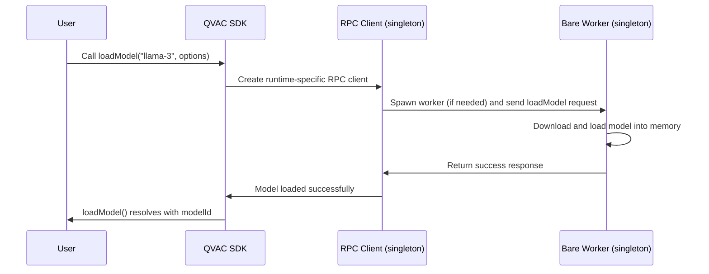
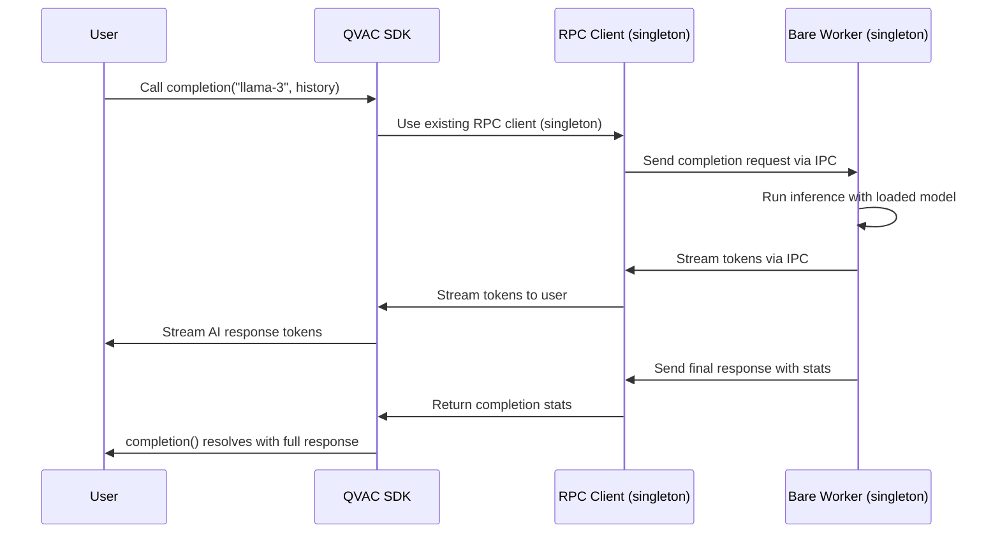

# How it works

What happens under the hood when you add QVAC SDK to your application.

## Overview

QVAC SDK supports multiple JS runtimes, but QVAC modules run only on Bare. When the SDK runs in a runtime other than Bare, it spawns a Bare worker where all AI operations will take place.

## Part 1: Model loading

The first time you call `loadModel()`, QVAC SDK performs a complete initialization sequence. _This is the only time a Bare worker process is ever spawned_ — subsequent calls reuse the same worker instance.

There is only a single RPC client and Bare worker per application, not per model — i.e., singleton pattern. The AI model is downloaded and loaded into memory, and registered with a unique ID. From that point on, it will be available for AI inference until you unload it — call `unloadModel()` to it.

## Part 2: AI inference

You can call `loadModel()` multiple times to make multiple models ready for use simultaneously. Additionally, you can perform AI inference multiple times with all of them. When you no longer need a model, call `unloadModel()` to free up resources.
